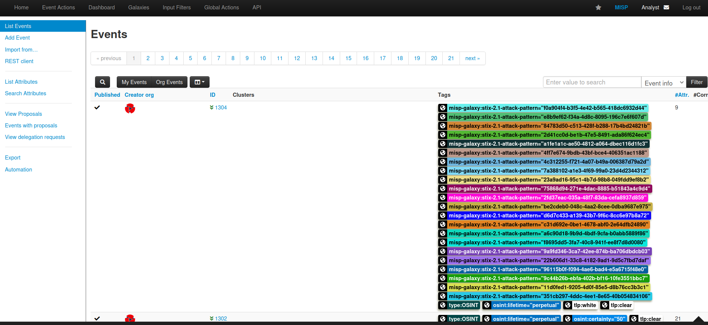

# #5: Using MISP

MISP (Malware Information Sharing Platform) is an open-source threat information platform that helps with the collection, storage, and distribution of threat intelligence and Indicators of Compromise (IOCs). These IOCs can be related to malware, cyber attacks, financial fraud, or any other intelligence shared within a trusted community.

CIRCL (Computer Incident Response Center Luxembourg) has published an event associated with a **PupyRAT infection**.

Since the organization is on alert for remote access trojans (RATs) and other active malware, my task is to investigate this event and correlate the details with my SIEM.

To start, I first searched for the infection name and clicked on the result:

Opening the result gave me access to more details. On the event page, I was able to see:

- The **Event ID**
- The **IP address** that has been mapped as the C2 (Command and Control) server
- The **threat actor group** known to use this type of attack
- The **impact on organizations** when this event occurs

This kind of structured information makes it easier to track and correlate malicious activity in my SIEM.