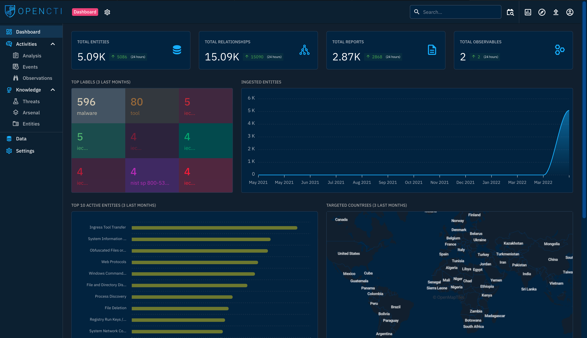

# #4: OpenCTI

[OpenCTI](https://github.com/OpenCTI-Platform/opencti) is another open-sourced platform designed to provide organisations with the means to manage CTI through the storage, analysis, visualisation and presentation of threat campaigns, malware and IOCs.

# OpenCTI Dashboard

Once I connected to the platform, the opening dashboard displayed various visual widgets summarizing the threat data ingested into OpenCTI. These widgets showed the current state of entities on the platform, including the total number of entities, relationships, reports, and observables ingested, as well as changes recorded within the last 24 hours.

---

## Activities & Knowledge

OpenCTI categorizes and presents entities under two main groups on the left-side panel:

- **Activities** – Covers security incidents ingested onto the platform in the form of reports. This makes it easier for analysts like me to investigate incidents.
- **Knowledge** – Provides linked data related to adversary tools, targeted victims, types of threat actors, and campaigns.

---

## Analysis

The **Analysis tab** contains input entities found in reports, along with their associated external references. Reports are central to OpenCTI since they capture knowledge on threats and events, making it easier to identify the source of information.

As an analyst, I can also add my own investigation notes or external resources to enrich knowledge. For example, I looked at the **Triton Software report published by MITRE ATT&CK**, which included detailed insights and relationships.

---

## Events

Security analysts investigate and track suspicious or malicious activities across their organizational network. Within the **Events tab**, I can record findings and enrich threat intelligence by creating associations for incidents.

---

## Observations

The **Observations tab** lists technical elements, detection rules, and artifacts identified during a cyberattack. These may include one or more identifiable indicators that help analysts like me map threat events during a hunt. I can also correlate observations from my environment with threat intel feeds.

---

## Threats

All information classified as threatening to an organization is stored under **Threats**, which includes:

- **Threat Actors** – Individuals or groups propagating malicious actions against targets.
- **Intrusion Sets** – Collections of TTPs, tools, malware, and infrastructure used by threat actors against similar targets. (APTs and well-known groups are listed here).
- **Campaigns** – Series of coordinated attacks over a given period, usually run by advanced persistent threat actors with specific objectives. These are often backed by nation-states, cybercrime syndicates, or other organized groups.

---

## Arsenal

This tab lists all tools and resources (both malicious and legitimate) identified from ingested knowledge. It includes:

- **Malware** – Known malware and trojans with details of identification and mapping. For example, I analyzed the **4H RAT malware** and explored its associations.
- **Attack Patterns** – TTPs adversaries use. Example: looking into the **Command-Line Interface** technique to analyze relationships and investigations.
- **Courses of Action (CoA)** – MITRE recommendations for preventing attack techniques from succeeding.
- **Tools** – Legitimate tools used for system maintenance/monitoring, but often abused by adversaries (e.g., CMD in CLI attacks).
- **Vulnerabilities** – Known software bugs and exposures, enriched with CVE data imported from MITRE.

---

## Entities

The **Entities tab** categorizes information based on sectors, countries, organizations, and individuals. This helps enrich knowledge on attacks, intrusion sets, or targeted groups.

---

## General Tabs Navigation

In day-to-day use, I navigate through different entities in OpenCTI to perform threat analysis. For this walkthrough, I explored **Cobalt Strike malware** under the Arsenal tab.

Each intelligence entity provides several views:

- **Overview Tab** – General details like entity ID, confidence level, description, relations with threats/intrusion sets/attack patterns, reports, and external references.
    
    
    
- **Knowledge Tab** – Linked information, reports, indicators, relations, and attack timelines. Analysts can also drill down into threats, attack vectors, and observables.
    
    
    
- **Analysis Tab** – Reports mentioning the entity, useful for guiding investigations.
    
    
    
- **Indicators Tab** – IOC information for threats/entities.
- **Data Tab** – Files uploaded or generated for export to share information.
- **History Tab** – Tracks all changes to elements, attributes, and relations.

---

## Assignment

As a SOC analyst, I have been tasked to investigate **CaddyWiper malware** and the **APT37 group**. Using the features and navigation in OpenCTI, I gathered the intelligence and correlated the information to strengthen my organization’s defenses.

---