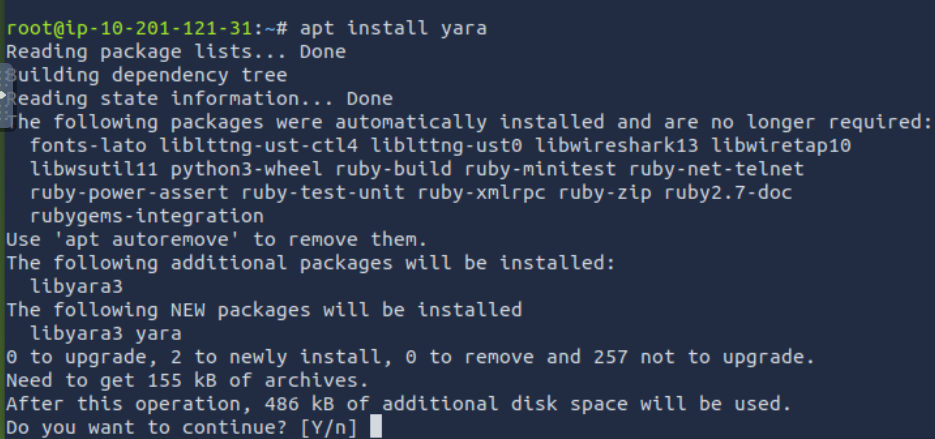

# #3: Yara, LOKI, Valhalla

First lets install yara on our system, 



Creating a file with it, and the opening it using text editor like nano to put an example rule snippet


Adding an example rule and then saving the nano editor after saving


Trying out the yara rule on a newly created file called “somefile”, and let’s look at the result. 


As the file exist Yara said examplerule because the pattern has been met. 

# YARA Conditions

As I continue learning YARA, I’m now exploring **conditions** and how they work in rules. At first, just checking whether a file exists isn’t very useful, so I need to learn how to apply conditions, strings, and meta information to make YARA rules more powerful.

---

## YARA Rule Structure (Quick Recap)

A YARA rule can contain these sections:

- **Meta** → For descriptive information (like comments, does not affect the rule).
- **Strings** → For searching specific text or hex patterns in files.
- **Condition** → For applying logic to decide if the rule matches.
- **Weight** → Used for scoring/matching weight (not always required).

---

## Meta Section

The **meta section** is basically a place to describe the purpose of my rule.

It’s just like adding comments in code — it doesn’t affect how the rule works, but it helps me (and others) understand what the rule is about.

Example:

```
rule helloworld_checker {
    meta:
        desc = "Checks if Hello World! string exists in files"
}

```

---

## Strings Section

This is where I define the strings (text or hex) I want to search for in files.

Example (searching for `"Hello World!"`):

```
rule helloworld_checker {
    strings:
        $hello_world = "Hello World!"
}

```

- Here, `$hello_world` is a variable holding the string `"Hello World!"`.

But to make the rule valid, I need a **condition** that uses this string.

---

## Conditions Section

To actually trigger the rule, I need to add conditions.

Example:

```
rule helloworld_checker {
    strings:
        $hello_world = "Hello World!"

    condition:
        $hello_world
}

```

- This means the rule will **match** if the string `"Hello World!"` is found in a file.

### Problem: Case Sensitivity

This rule won’t match `"hello world"` or `"HELLO WORLD"`.

To solve this, I can define multiple strings and use `any of them`.

```
rule helloworld_checker {
    strings:
        $hello_world = "Hello World!"
        $hello_world_lowercase = "hello world"
        $hello_world_uppercase = "HELLO WORLD"

    condition:
        any of them
}

```

Now the rule matches if **any** of the following appear in a file:

1. `"Hello World!"`
2. `"hello world"`
3. `"HELLO WORLD"`

---

## Operators in Conditions

YARA also supports operators, just like programming:

- `<=` → less than or equal to
- `>=` → greater than or equal to
- `!=` → not equal to

Example:

```
rule helloworld_checker {
    strings:
        $hello_world = "Hello World!"

    condition:
        #hello_world <= 10
}

```

What this does:

1. Looks for `"Hello World!"`.
2. Matches only if the string appears **10 times or fewer**.

---

## Combining Conditions with Keywords

I can combine multiple conditions using:

- `and`
- `or`
- `not`

Example: Check if a file contains `"Hello World!"` **and** is smaller than 10 KB.

```
rule helloworld_checker {
    strings:
        $hello_world = "Hello World!"

    condition:
        $hello_world and filesize < 10KB
}

```

- The rule only matches if **both conditions are true**:
    - The file contains `"Hello World!"`.
    - The file size is under **10 KB**.

---

## Example in Action

### Case 1: File size too large → Rule fails

- The file contains `"Hello World!"`.
- But the file size is **larger than 10 KB**.
- The rule does **not** match.

```bash
cmnatic@thm:~$ yara myfirstrule.yar mytextfile.txt
<no output>

```

---

### Case 2: File size small enough → Rule matches

- The file contains `"Hello World!"`.
- File size is **less than 10 KB**.
- The rule **matches successfully**.

```bash
cmnatic@thm:~$ yara myfirstrule.yar mytextfile.txt
helloworld_textfile_checker mytextfile.txt

```

Here:

- `helloworld_textfile_checker` = name of the rule.
- `mytextfile.txt` = name of the matched file.

---

# Using LOKI for Threat Hunting

As part of my training as a security analyst, I’m learning how to use **LOKI**, a free IOC and YARA rule scanner. LOKI is helpful in two main cases:

1. **When threat intel reports or blogs share IOCs** (like hashes, IPs, domains, etc.), I can use LOKI’s rules to detect them in my environment.
2. **When I encounter unknown files** that my security tools didn’t detect, I can write my own rules and use LOKI to scan them (useful in incident response and forensics).

The good thing is, LOKI already comes with a set of YARA rules that I can use right away to start scanning endpoints.

---

## Step 1: Locating LOKI

Inside the tools directory, I checked what was available:

```bash
cmnatic@thm-yara:~/tools$ ls
Loki  yarGen

```

Here I see two tools: **Loki** and **yarGen**.

---

## Step 2: Exploring LOKI

I navigated into the LOKI directory and ran the help command to see what options are available:

```bash
python loki.py -h

```

- This showed me all available parameters I can use with LOKI.

If I was running LOKI on my own machine, the first thing I should do is update signatures:

```bash
python loki.py --update

```

- This downloads/updates the `signature-base` directory that LOKI uses to scan for known threats.
- On the TryHackMe VM, this step was already done.

---

## Step 3: Inspecting Signature Base

I looked into the **signature-base** directory:

```bash
cmnatic@thm-yara:~/tools/Loki/signature-base$ ls
iocs  misc  yara

```

- **iocs** → IOC signatures
- **misc** → miscellaneous detection rules
- **yara** → YARA rules that LOKI uses for hunting

I then navigated into the `yara` directory to review some of the rules. This gave me a good idea of what LOKI looks for when scanning.

---

## Step 4: Running LOKI on Suspicious Files

In this lab scenario, I’m acting as a security analyst at a mid-size law firm.

- A co-worker discovered **suspicious files** on the corporate web server while performing updates.
- The suspicious files were copied into my machine under the `suspicious-files` directory.
- My task is to analyze them using LOKI.

I navigated into the suspicious file directory:

```bash
cmnatic@thm-yara:~/suspicious-files/file1$

```

Then I ran LOKI, pointing it at the current directory (`-p .`):

```bash
python ../../tools/Loki/loki.py -p .

```

---

# **Valhalla**

Valhalla is an online Yara feed created and hosted by Nextron-Systems (erm, Florian Roth). By now, you should be aware of the ridiculous amount of time and energy Florian has dedicated to creating these tools for the community. Maybe we should have just called this the Florian Roth room. (lol)

Per the website, "*Valhalla boosts your detection capabilities with the power of thousands of hand-crafted high-quality YARA rules.*"


Link : [Valhalla YARA Rules - Valhalla](https://valhalla.nextron-systems.com/)
